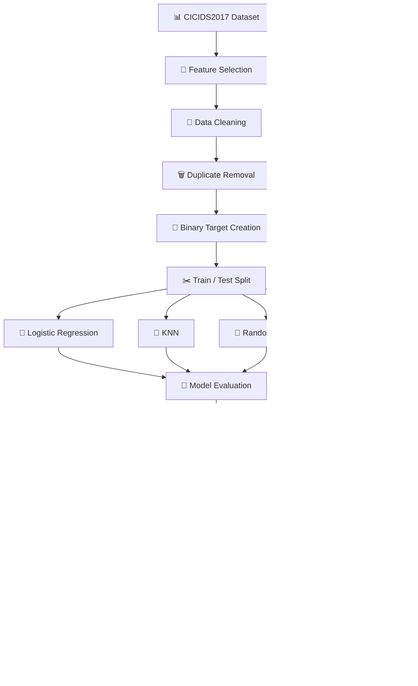

<div align="center">

# 🛡️ CyberSentinel AI

### Real-Time Network Intrusion Detection System Using Machine Learning

**Detect suspicious network traffic using machine learning, probability-based classification, and real-time network-flow analysis.**

<br>

<p>
  
  
  
  
</p>

<p>
  
  
  
  
</p>

<br>

> 🚨 **CyberSentinel AI analyzes network-flow characteristics and classifies traffic as `ATTACK` or `NOT ATTACK` using trained machine-learning models.**

<br>

[🚀 Overview](#-overview) •
[🧠 ML Pipeline](#-machine-learning-pipeline) •
[🖥️ Dashboard](#️-streamlit-application) •
[📡 Live Monitor](#-real-time-monitoring) •
[🛠️ Installation](#️-installation)

</div>

---

# 📌 Table of Contents

- [🌟 Overview](#-overview)
- [🎯 Objectives](#-objectives)
- [🧠 Classification Problem](#-classification-problem)
- [📊 Dataset](#-dataset)
- [🔧 Selected Features](#-selected-features)
- [🏗️ System Architecture](#️-system-architecture)
- [🧠 Machine Learning Pipeline](#-machine-learning-pipeline)
- [⚖️ Class Imbalance](#️-class-imbalance)
- [🤖 Machine Learning Models](#-machine-learning-models)
- [📏 Model Evaluation](#-model-evaluation)
- [🏆 Model Selection](#-model-selection)
- [🎚️ Threshold Optimization](#️-threshold-optimization)
- [🔍 Feature Importance](#-feature-importance)
- [📡 Real-Time Monitoring](#-real-time-monitoring)
- [🌐 Streamlit Application](#️-streamlit-application)
- [🖥️ Local Desktop Monitoring](#️-local-desktop-monitoring)
- [☁️ Streamlit Cloud Deployment](#️-streamlit-cloud-deployment)
- [📁 Project Structure](#-project-structure)
- [📦 Model Artifacts](#-model-artifacts)
- [🛠️ Installation](#️-installation)
- [▶️ Running the Application](#️-running-the-application)
- [🛡️ Security & Ethical Considerations](#️-security--ethical-considerations)
- [⚠️ Limitations](#️-limitations)
- [🔮 Future Improvements](#-future-improvements)
- [📸 Screenshots](#-screenshots)
- [👨‍💻 Author](#-author)
- [⚖️ Disclaimer](#️-disclaimer)

---

# 🌟 Overview

**CyberSentinel AI** is an AI-powered network intrusion detection system designed to identify potentially malicious network traffic using machine learning.

The project uses the **CICIDS2017 intrusion detection dataset** and compares multiple machine-learning algorithms:

- Logistic Regression
- K-Nearest Neighbors (KNN)
- Random Forest
- XGBoost

The selected model can then be used in a network-flow monitoring pipeline to classify traffic as:

| Prediction | Meaning |
|:---:|:---|
| ✅ **NOT ATTACK** | Network flow is classified as benign |
| 🚨 **ATTACK** | Network flow is classified as potentially malicious |

The project also includes:

- 📊 Interactive Streamlit dashboard
- 📡 Local Windows real-time monitoring
- 🕵️ Network-flow analysis
- 📈 Prediction visualization
- 🎚️ Probability-based threshold classification
- 🧪 Model comparison and evaluation
- 🖥️ Scapy + Npcap integration

---

# 🎯 Objectives

The main objectives of CyberSentinel AI are:

1. Build a machine-learning-based network intrusion detection system.
2. Convert multiclass intrusion labels into a binary classification problem.
3. Compare classical and ensemble machine-learning algorithms.
4. Evaluate models using security-relevant classification metrics.
5. Select the best-performing model using appropriate evaluation criteria.
6. Implement probability-based threat classification.
7. Develop a local real-time network monitoring prototype.
8. Provide an interactive interface for network-flow analysis and prediction.

---

# 🧠 Classification Problem

The original **CICIDS2017** dataset contains multiple types of network traffic and attack categories.

For this project, the original labels are converted into a **binary classification problem**.

### 🎯 Target Mapping

| Original Label | Binary Class |
|:---|:---:|
| `BENIGN` | `NOT ATTACK` |
| `DDoS` | `ATTACK` |
| `DoS Hulk` | `ATTACK` |
| `DoS GoldenEye` | `ATTACK` |
| `PortScan` | `ATTACK` |
| `FTP-Patator` | `ATTACK` |
| `SSH-Patator` | `ATTACK` |
| `Bot` | `ATTACK` |
| `Web Attack` | `ATTACK` |
| `Infiltration` | `ATTACK` |
| `Heartbleed` | `ATTACK` |
| Other malicious labels | `ATTACK` |

### Final Encoding

```text
0 → NOT ATTACK
1 → ATTACK
```

This allows the model to focus on the primary security question:

> **Is this network flow benign or potentially malicious?**

---

# 📊 Dataset

## CICIDS2017

CyberSentinel AI uses the **CICIDS2017 intrusion detection dataset** developed by the Canadian Institute for Cybersecurity.

The dataset contains benign network traffic and multiple realistic attack scenarios represented through network-flow characteristics. :contentReference[oaicite:1]{index=1}

### 🔗 Official Dataset

[Canadian Institute for Cybersecurity — CICIDS2017](https://www.unb.ca/cic/datasets/ids-2017.html)

### Dataset Features Include

- Destination Port
- Flow Duration
- Forward packet count
- Backward packet count
- Forward bytes
- Backward bytes
- Flow byte rate
- Flow packet rate
- TCP flag statistics
- Packet-length statistics
- Network traffic labels

The project creates a reduced feature dataset containing the features required for machine learning and the live-flow prototype.

---

# 🔧 Selected Features

CyberSentinel AI currently uses **18 network-flow features**:

| # | Feature |
|---:|:---|
| 01 | Destination Port |
| 02 | Flow Duration |
| 03 | Total Fwd Packets |
| 04 | Total Backward Packets |
| 05 | Total Length of Fwd Packets |
| 06 | Total Length of Bwd Packets |
| 07 | Flow Bytes/s |
| 08 | Flow Packets/s |
| 09 | Fwd Packets/s |
| 10 | Bwd Packets/s |
| 11 | SYN Flag Count |
| 12 | ACK Flag Count |
| 13 | RST Flag Count |
| 14 | Average Packet Size |
| 15 | Min Packet Length |
| 16 | Max Packet Length |
| 17 | Packet Length Mean |
| 18 | Packet Length Std |

These features describe traffic volume, packet behavior, flow duration, packet rates, packet statistics, and TCP characteristics. :contentReference[oaicite:2]{index=2}

---

# 🏗️ System Architecture



---

# 🔄 Machine Learning Pipeline

CyberSentinel AI follows an end-to-end machine-learning workflow.

```text
┌──────────────────────────────┐
│     CICIDS2017 Dataset       │
└──────────────┬───────────────┘
               │
               ▼
┌──────────────────────────────┐
│      Feature Selection       │
└──────────────┬───────────────┘
               │
               ▼
┌──────────────────────────────┐
│        Data Cleaning         │
└──────────────┬───────────────┘
               │
               ▼
┌──────────────────────────────┐
│      Duplicate Removal       │
└──────────────┬───────────────┘
               │
               ▼
┌──────────────────────────────┐
│      Binary Target           │
│     0 = Benign / 1 = Attack  │
└──────────────┬───────────────┘
               │
               ▼
┌──────────────────────────────┐
│       Train / Test Split     │
└──────────────┬───────────────┘
               │
       ┌───────┼────────┬────────┐
       ▼       ▼        ▼        ▼
    Logistic   KNN   Random   XGBoost
   Regression       Forest
       │       │        │        │
       └───────┴────────┴────────┘
               │
               ▼
┌──────────────────────────────┐
│       Model Comparison       │
└──────────────┬───────────────┘
               │
               ▼
┌──────────────────────────────┐
│         Best Model           │
└──────────────┬───────────────┘
               │
               ▼
┌──────────────────────────────┐
│    Threshold Optimization    │
└──────────────┬───────────────┘
               │
               ▼
┌──────────────────────────────┐
│      Live Flow Inference     │
└──────────────┬───────────────┘
               │
               ▼
┌──────────────────────────────┐
│      Streamlit Dashboard     │
└──────────────────────────────┘
```

---

# 🧹 Data Preparation

## 1. Feature Reduction

The original CICIDS2017 CSV files are reduced to the required network-flow features.

```text
Raw CICIDS2017 CSV Files
          ↓
   Feature Selection
          ↓
cicids_required_features.csv
```

---

## 2. Data Cleaning

The pipeline performs:

### Column Normalization

Leading and trailing whitespace is removed from column names.

### Numeric Conversion

Network-flow features are converted into numeric values.

### Infinite-Value Handling

Infinite values are replaced with `NaN`.

### Missing-Value Handling

Rows containing invalid feature values are removed.

### Duplicate Handling

Exact duplicate rows are identified and removed before model training.

> ⚠️ Removing duplicates is important because duplicate flows appearing across training and testing data can create overly optimistic evaluation results.

---

# ⚖️ Class Imbalance

Network intrusion datasets can contain significantly more benign traffic than malicious traffic.

CyberSentinel AI checks class distribution before model training.

For tree-based models, class weighting is handled using:

```text
scale_pos_weight
```

The value is calculated as:

```text
scale_pos_weight =
    number of NOT_ATTACK samples
    /
    number of ATTACK samples
```

This helps the classifier give additional importance to the minority attack class.

---

# ✂️ Train / Test Split

The cleaned dataset is divided into:

```text
80% → Training
20% → Testing
```

A stratified split is used:

```python
train_test_split(
    X,
    y,
    test_size=0.20,
    stratify=y,
    random_state=42
)
```

Stratification helps maintain a similar attack/non-attack distribution across the training and testing sets.

---

# 🤖 Machine Learning Models

CyberSentinel AI evaluates four different algorithms.

---

## 1️⃣ Logistic Regression

Logistic Regression is used as a **linear baseline model**.

It provides a useful reference point for determining whether more complex algorithms provide meaningful improvements.

Scaling is applied before Logistic Regression.

---

## 2️⃣ K-Nearest Neighbors

KNN is included as a **distance-based baseline**.

Because KNN can become computationally expensive for very large network-flow datasets, a representative training subset is used for the experiment.

Standardization is applied because KNN depends on distance calculations.

---

## 3️⃣ Random Forest

Random Forest provides a strong nonlinear ensemble baseline.

Advantages include:

- 🌳 Nonlinear decision boundaries
- 🔀 Ensemble learning
- ⚖️ Class balancing
- 🚫 No feature standardization required

---

## 4️⃣ XGBoost

XGBoost is used as the primary gradient-boosting candidate.

Example configuration:

```python
XGBClassifier(
    objective="binary:logistic",
    n_estimators=300,
    max_depth=6,
    learning_rate=0.05,
    subsample=0.8,
    colsample_bytree=0.8,
    scale_pos_weight=scale_pos_weight,
    eval_metric="logloss",
    tree_method="hist",
    random_state=42
)
```

The histogram tree method is used to improve training efficiency on large tabular datasets.

---

# 📏 Model Evaluation

The models are evaluated using multiple metrics rather than accuracy alone.

| Metric | Purpose |
|:---|:---|
| **Accuracy** | Overall classification correctness |
| **Precision** | Measures false-alarm control |
| **Recall** | Measures how many attacks are detected |
| **F1-Score** | Balances precision and recall |
| **ROC-AUC** | Measures class separation across thresholds |
| **PR-AUC** | Useful for imbalanced binary classification |
| **Inference Time** | Measures prediction efficiency |

### Accuracy

```text
Accuracy =
Correct Predictions / Total Predictions
```

### Precision

```text
Precision =
True Positives /
(True Positives + False Positives)
```

### Recall

```text
Recall =
True Positives /
(True Positives + False Negatives)
```

### F1-Score

```text
F1 =
2 × Precision × Recall /
(Precision + Recall)
```

### PR-AUC

Precision-Recall AUC is used as the **primary model-selection metric**, while F1-score and Recall are also considered.

---

# 🏆 Model Selection

The four models are compared using a common evaluation table.

| Model | Accuracy | Precision | Recall | F1 | ROC-AUC | PR-AUC | Inference Time |
|:---|---:|---:|---:|---:|---:|---:|---:|
| Logistic Regression | — | — | — | — | — | — | — |
| KNN | — | — | — | — | — | — | — |
| Random Forest | — | — | — | — | — | — | — |
| XGBoost | — | — | — | — | — | — | — |

> 📌 The actual values depend on the model-training results.

The project does **not** assume that XGBoost will always win.

The final model is selected using measured validation performance, with **PR-AUC** as the primary selection criterion.

---

# 🎚️ Threshold Optimization

The default classification threshold is:

```text
0.50
```

However, the best threshold for an intrusion-detection system does not necessarily need to be 0.50.

CyberSentinel AI evaluates multiple thresholds:

```text
0.10
0.15
0.20
0.25
...
0.90
```

For each threshold, the system calculates:

- Precision
- Recall
- F1-score

The threshold that provides the strongest F1-score can then be stored and used during inference.

### Example

```text
Attack Probability = 0.91

Optimized Threshold = 0.50

0.91 >= 0.50
        ↓
    🚨 ATTACK
```

This approach provides more flexibility than relying on a fixed 0.50 decision boundary.

---

# 🔍 Feature Importance

For the XGBoost model, feature importance is analyzed to identify which network-flow characteristics contribute most strongly to prediction.

Example feature categories include:

- 📈 Flow rates
- 📦 Packet counts
- 📏 Packet lengths
- 🔌 Destination ports
- 🚦 TCP flag counts
- ⏱️ Flow duration

Feature importance analysis provides additional insight into which characteristics the model relies on during classification.

---

# 📡 Real-Time Monitoring

CyberSentinel AI also includes a **local Windows real-time monitoring prototype**.

### Architecture

```text
        🌐 Network Interface
                 │
                 ▼
              Npcap
                 │
                 ▼
              Scapy
                 │
                 ▼
          Packet Capture
                 │
                 ▼
          Flow Aggregation
                 │
                 ▼
          Feature Extraction
                 │
                 ▼
          Trained ML Model
                 │
                 ▼
        ┌────────┴────────┐
        ▼                 ▼
   ✅ NOT ATTACK       🚨 ATTACK
        │                 │
        └────────┬────────┘
                 ▼
        Threat Probability
```

### Technologies

| Technology | Role |
|:---|:---|
| **Npcap** | Windows packet capture support |
| **Scapy** | Packet capture and parsing |
| **Flow Engine** | Network-flow aggregation |
| **ML Model** | Traffic classification |

The live monitoring workflow extracts network-flow features and passes them to the trained model for inference.

---

# 📡 Live Flow Processing

The live pipeline extracts features corresponding to the training schema:

```text
Destination Port
Flow Duration
Forward Packet Count
Backward Packet Count
Forward Bytes
Backward Bytes
Flow Bytes/s
Flow Packets/s
Fwd Packets/s
Bwd Packets/s
SYN Flag Count
ACK Flag Count
RST Flag Count
Packet Size Statistics
```

The resulting flow is converted into the same feature schema expected by the trained model.

### Example

```text
Attack Probability = 0.91
Optimized Threshold = 0.50

0.91 >= 0.50

        ↓

🚨 ATTACK
```

---

# 🌐 Streamlit Application

The Streamlit application provides an interactive interface for network-flow analysis and prediction.

### Main Capabilities

| Feature | Supported |
|:---|:---:|
| Upload network-flow CSV | ✅ |
| Validate required features | ✅ |
| Clean invalid values | ✅ |
| Run model predictions | ✅ |
| Display attack probabilities | ✅ |
| Calculate attack rate | ✅ |
| Display traffic statistics | ✅ |
| Visualize predictions | ✅ |
| Show recent results | ✅ |
| Download prediction results | ✅ |

### Dashboard Workflow

```text
📂 Upload CSV
      ↓
🔎 Validate Features
      ↓
🧹 Clean Input
      ↓
🤖 ML Prediction
      ↓
📊 Attack Probability
      ↓
🎯 Classification
      ↓
📈 Analytics Dashboard
```

---

# 🖥️ Local Desktop Monitoring

The local Windows application can access the machine's network interface through **Npcap + Scapy**.

```text
🖥️ Windows Machine
        │
        ▼
🌐 Network Interface
        │
        ▼
      Npcap
        │
        ▼
      Scapy
        │
        ▼
🛡️ CyberSentinel AI
        │
        ▼
🚨 Real-Time Prediction
```

> ⚠️ The local monitoring component is intended for authorized traffic and controlled environments.

---

# ☁️ Streamlit Cloud Deployment

The Streamlit dashboard can be deployed through GitHub and Streamlit Community Cloud.

### Cloud Architecture

```text
GitHub Repository
        │
        ▼
Streamlit Community Cloud
        │
        ▼
CyberSentinel AI
        │
        ▼
Upload Network-Flow CSV
        │
        ▼
Best Model
        │
        ▼
Prediction
```

> 💡 The cloud application runs remotely and therefore does **not** directly capture the user's local Wi-Fi/Ethernet traffic.

For real-time local monitoring, use the Windows application.

---

# 📁 Project Structure

```text
CyberSentinel-AI/
│
├── 📂 data/
│   ├── 📂 processed/
│   │   ├── cicids_required_features.csv
│   │   └── cicids2017_combined.csv
│   │
│   └── 📂 raw/
│       ├── Friday-WorkingHours-Afternoon-DDos.pcap_ISCX.csv
│       ├── Friday-WorkingHours-Afternoon-PortScan.pcap_ISCX.csv
│       ├── Friday-WorkingHours-Morning.pcap_ISCX.csv
│       ├── Monday-WorkingHours.pcap_ISCX.csv
│       ├── Thursday-WorkingHours-Afternoon-Infiltration.pcap_ISCX.csv
│       ├── Thursday-WorkingHours-Morning-WebAttacks.pcap_ISCX.csv
│       ├── Tuesday-WorkingHours.pcap_ISCX.csv
│       └── Wednesday-workingHours.pcap_ISCX.csv
│
├── 📂 notebooks/
│   └── 01_XGBoost_Training.ipynb
│
├── 📂 models/
│   ├── best_model.pkl
│   ├── features.pkl
│   ├── knn_pipeline.pkl
│   ├── logistic_regression_pipeline.pkl
│   ├── model_metadata.json
│   ├── random_forest.pkl
│   └── xgboost.pkl
│
├── 📂 src/
│   ├── check_data.py
│   ├── combine_data.py
│   ├── combine_required_features.py
│   ├── live_detector.py
│   ├── live_flow.py
│   ├── live_monitor.py
│   └── prepare_data.py
│
├── 📄 app.py
├── 📄 requirements.txt
├── 📄 run_live.py
├── 📄 .gitignore
├── 🖼️ Screenshot 2026-08-28 191742.png
└── 📄 README.md
```

Your repository already contains the `models`, `src`, `app.py`, `requirements.txt`, `run_live.py`, and README structure shown above. :contentReference[oaicite:3]{index=3}

---

# 💾 Model Artifacts

After training, the project stores model artifacts such as:

```text
models/
│
├── best_model.pkl
├── features.pkl
└── model_metadata.json
```

### `best_model.pkl`

Contains the selected trained machine-learning model.

### `features.pkl`

Contains the exact feature order expected by the trained model.

### `model_metadata.json`

Stores model-related information such as:

```json
{
    "best_model": "XGBoost",
    "threshold": 0.5,
    "target_mapping": {
        "0": "NOT ATTACK",
        "1": "ATTACK"
    }
}
```

> 📌 Exact values depend on the model-selection results generated during training.

---

# 📦 Installation

## 1️⃣ Clone the Repository

```bash
git clone https://github.com/SoudipMondal12/CyberSentinel-AI.git
```

```bash
cd CyberSentinel-AI
```

---

## 2️⃣ Create a Virtual Environment

### 🪟 Windows

```powershell
python -m venv venv
```

Activate it:

```powershell
.\venv\Scripts\Activate.ps1
```

### 🐧 Linux / 🍎 macOS

```bash
python3 -m venv venv
```

```bash
source venv/bin/activate
```

---

## 3️⃣ Install Dependencies

```bash
pip install -r requirements.txt
```

---

# ▶️ Running the Application

## 🌐 Streamlit Dashboard

Run:

```bash
streamlit run app.py
```

Then open:

```text
http://localhost:8501
```

Upload a network-flow CSV containing the required features.

---

# 📡 Running the Local Real-Time Monitor

The local real-time monitoring component requires **Npcap**.

### Install Npcap

[Npcap Official Website](https://npcap.com/)

Then open **PowerShell as Administrator** and run:

```powershell
python run_live.py
```

The monitoring application can then capture authorized local network traffic and run the trained model against the generated flows.

---

# 📓 Model Development Notebook

The main modelling workflow is available in:

```text
notebooks/01_XGBoost_Training.ipynb
```

### Notebook Workflow

```text
Load Dataset
     ↓
Data Inspection
     ↓
Data Cleaning
     ↓
Duplicate Removal
     ↓
Binary Target Creation
     ↓
Exploratory Analysis
     ↓
Train/Test Split
     ↓
Logistic Regression
     ↓
KNN
     ↓
Random Forest
     ↓
XGBoost
     ↓
Model Comparison
     ↓
Confusion Matrix
     ↓
ROC Curve
     ↓
Precision-Recall Curve
     ↓
Threshold Analysis
     ↓
Feature Importance
     ↓
Best Model Selection
     ↓
Model Saving
```

---

# 📊 Example Prediction

A sample network flow could contain:

```text
Destination Port       : 443
Flow Duration          : 125000
Flow Packets/s         : 1842.6
Flow Bytes/s           : 958421.2
SYN Flag Count         : 2
ACK Flag Count         : 10
Packet Length Mean     : 520.4
```

The model could produce:

```text
Attack Probability : 94.72%
```

Result:

```text
🚨 ATTACK
```

Another flow could produce:

```text
Attack Probability : 3.18%
```

Result:

```text
✅ NOT ATTACK
```

> ⚠️ A probability score is a model output, not definitive proof that malicious activity occurred.

---

# 📁 Dataset Handling

Large datasets should not be committed to the Git repository.

Typical ignored files include:

```gitignore
data/raw/
*.csv
*.zip
*.parquet
```

The trained model artifacts can remain available:

```text
models/
├── best_model.pkl
├── features.pkl
└── model_metadata.json
```

This keeps the repository manageable while allowing the application to run using the trained model.

---

# 🛡️ Security & Ethical Considerations

CyberSentinel AI should only be used for:

- ✅ Networks you own
- ✅ Systems you administer
- ✅ Authorized security testing
- ✅ Academic or research environments
- ✅ Controlled laboratory environments

Do **not** capture or analyze network traffic belonging to other people or organizations without appropriate authorization.

> 🛡️ CyberSentinel AI is a machine-learning research and monitoring prototype, not a replacement for a complete enterprise security stack.

---

# ⚠️ Limitations

## 1. Dataset-to-Live Distribution Shift

The model is trained using CICIDS2017 traffic.

Real-world traffic can have significantly different characteristics.

Therefore:

```text
High ATTACK Probability
        ≠
Confirmed Real-World Attack
```

False positives and false negatives are possible.

---

## 2. Live Feature Compatibility

The live monitoring pipeline calculates flow features from captured packets.

Although the feature names and overall definitions are aligned with the training schema, exact implementation details can differ from the process used to generate the original CICIDS2017 flow data.

For production deployment, the live feature-generation process should be validated against the exact training-time feature definitions.

---

## 3. Local Monitoring Scope

The Windows application monitors traffic visible to the local capture interface.

It does not automatically provide visibility into every device connected to a network.

---

## 4. Production IDS Limitations

CyberSentinel AI is not intended to replace enterprise IDS/IPS or SIEM systems.

A production deployment would require additional infrastructure such as:

```text
Network Sensors
      ↓
Flow Collectors
      ↓
Authentication
      ↓
Alert Management
      ↓
Data Retention
      ↓
Model Monitoring
      ↓
Concept Drift Detection
      ↓
Centralized Logging
      ↓
Security Operations Workflow
```

---

# 🔮 Future Improvements

Potential future improvements include:

### 🧠 Advanced Feature Engineering

Add features such as:

- Inter-arrival time statistics
- TCP window features
- Active/idle statistics
- Subflow statistics
- Header statistics

### 🎯 Multiclass Detection

Extend the current:

```text
BENIGN
ATTACK
```

classification into:

```text
BENIGN
DDoS
DoS
PortScan
Brute Force
Bot
Web Attack
Infiltration
...
```

### 📡 Improved Live Feature Extraction

Develop a more complete CICFlowMeter-compatible live flow-generation pipeline.

### 🔍 Explainability

Integrate SHAP or another explanation framework to provide feature-level explanations for individual predictions.

### 📈 Model Monitoring

Possible additions:

```text
Concept Drift Detection
        ↓
Prediction Monitoring
        ↓
False-Positive Tracking
        ↓
Model Retraining
        ↓
Performance Monitoring
```

### 🌐 Centralized Security Architecture

A larger deployment could use:

```text
Network Sensors
       ↓
Flow Collector
       ↓
Message Queue
       ↓
Inference API
       ↓
XGBoost
       ↓
Alert Engine
       ↓
Database
       ↓
Security Dashboard
```

---

# 🧰 Technology Stack

| Technology | Purpose |
|:---|:---|
| 🐍 Python | Core development |
| 🐼 Pandas | Data processing |
| 🔢 NumPy | Numerical computation |
| 🤖 Scikit-learn | ML preprocessing and baseline models |
| 🚀 XGBoost | Gradient-boosting classifier |
| 🕵️ Scapy | Network packet capture and analysis |
| 🌐 Npcap | Windows packet capture |
| 🎨 Streamlit | Web-based analysis dashboard |
| 🖥️ PySide6 | Local desktop monitoring interface |
| 📊 Plotly | Interactive visualization |
| 💾 Joblib | Model serialization |
| 📓 Jupyter Notebook | Model experimentation |

---

# 📸 Screenshots

## 🛡️ CyberSentinel AI Dashboard

<p align="center">
  
</p>

### Repository Screenshot

The image above is loaded directly from the repository using:

```text
./Screenshot 2026-08-28 191742.png
```

> 💡 Keeping the image in the repository root beside `README.md` allows GitHub to render it automatically.

---

# 📈 Project Workflow

```text
                    ┌─────────────┐
                    │ CICIDS2017  │
                    │   Dataset   │
                    └──────┬──────┘
                           │
                           ▼
                    Feature Reduction
                           │
                           ▼
                     Data Cleaning
                           │
                           ▼
                   Duplicate Handling
                           │
                           ▼
                    Binary Labeling
                           │
                    ┌──────┴──────┐
                    │             │
                    ▼             ▼
               NOT ATTACK      ATTACK
                    │             │
                    └──────┬──────┘
                           │
                           ▼
                    Train/Test Split
                           │
           ┌───────────────┼───────────────┐
           ▼               ▼               ▼
     Logistic Regression  KNN       Random Forest
           │               │               │
           └───────────────┼───────────────┘
                           │
                           ▼
                        XGBoost
                           │
                           ▼
                    Model Evaluation
                           │
                           ▼
                      Best Model
                           │
                           ▼
                  Threshold Optimization
                           │
                           ▼
                    Model Artifact
                           │
              ┌────────────┴────────────┐
              ▼                         ▼
       Local Monitoring          Streamlit Dashboard
        Scapy + Npcap               CSV Analysis
              │                         │
              └────────────┬────────────┘
                           ▼
                 🚨 ATTACK / ✅ NOT ATTACK
```

---

# ⭐ Project Highlights

<table>
<tr>
<td>

✅ Binary Network Intrusion Detection  
✅ CICIDS2017-Based Modeling  
✅ Four ML Model Comparison  
✅ Logistic Regression  
✅ KNN  
✅ Random Forest  
✅ XGBoost  

</td>

<td>

✅ Class-Imbalance Handling  
✅ Stratified Train/Test Evaluation  
✅ PR-AUC-Based Model Selection  
✅ Threshold Optimization  
✅ Feature Importance Analysis  
✅ Real-Time Network Monitoring  
✅ Streamlit Dashboard  

</td>
</tr>

<tr>
<td>

✅ Scapy Integration  
✅ Npcap Integration  
✅ Windows Monitoring  
✅ Model Serialization  
✅ Prediction Probability  

</td>

<td>

✅ Network-Flow Analysis  
✅ Interactive Visualization  
✅ CSV-Based Inference  
✅ Desktop Monitoring Prototype  
✅ Deployment Workflow  

</td>
</tr>
</table>

---

# 👨‍💻 Author

<div align="center">

## Soudip Mondal

### Machine Learning • AI • Cybersecurity

Building practical AI systems that combine machine learning, intelligent automation, and real-world problem solving.

<br>

⭐ **If you found this project interesting, consider giving the repository a star!**

</div>

---

# ⚖️ Disclaimer

CyberSentinel AI is an **educational and research-oriented network security project**.

Predictions generated by machine-learning models should be treated as **security signals requiring further investigation**, rather than definitive proof of malicious activity.

Use this software only on networks and systems where you have appropriate authorization.

---

<div align="center">

## 🛡️ CyberSentinel AI

### Detect. Analyze. Investigate. 🔍

**Built with Python • Scikit-learn • XGBoost • Scapy • Npcap • Streamlit • Plotly**

<br>

⭐ **Star the repository if you like the project!** ⭐

</div>
